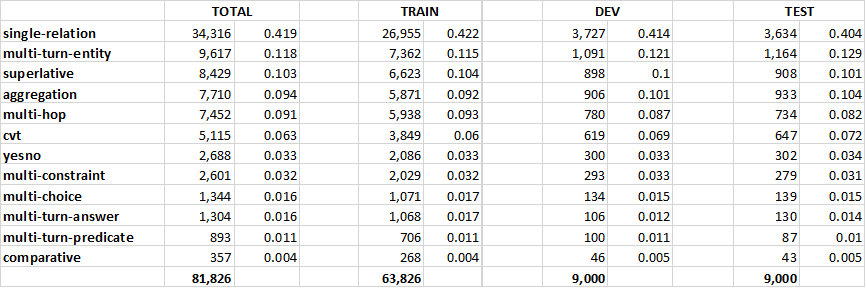
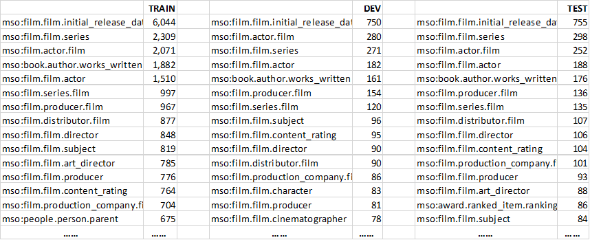
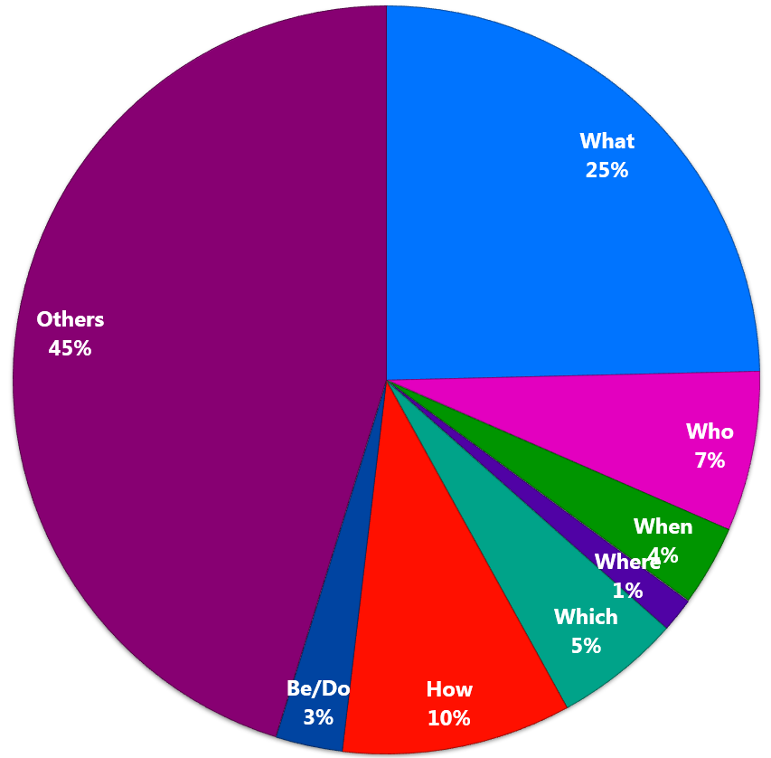
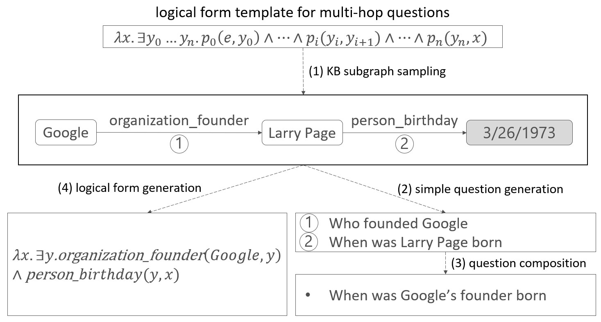

# MSParS: a Multi-perspective Semantic ParSing Dataset for Knowledge-based Question Answering

## Introduction

MSParS is a large-scale dataset for Knowledge-based Semantic Parsing including single and multi-turn Question Answering.
The whole dataset consists of 81,826 samples annotated by human English-speakers. 
We randomly shuffle these samples and use 80\% of them (63,826) as training set, 10\% as validation set (9,000), and the remaining 10\% as test set (9,000).
Note that for test set we only publish the questions without annotations, as this dataset is supporting an [open evaluation](#nlpcc-2019) now. 

Each sample is a quadruple consists of:
* a question (or multiple questions for multi-turn QA)
* the logical form(s) representing the question(s)
* the parameters (entity/type/value) extracted from the question(s) 
* the question type(s)

Different from some exisiting Semantic Parsing or Question Answering datasets containing only simple questions (single-relation), MSParS have 9 types of question including single-relation, multi-hop, multi-constraint, superlative, aggregation, comparative, yesno, cvt, and multi-choice. Considering the additional 3 types of multi-turn QA (multi-turn-entity, multi-turn-predicate, multi-turn-answer), the total number of the question types is 12. 

MSParS dataset is based on Satori Knoledge Base. The entities, relations and types in MSParS are following the standard forms in Satori. Each logical form (lambda calculus) can be translated into a standard SPARQL query and refers to one or more subgraphs in Satori. A KB snippets of Satori will be released later.

## Format and example

```
<question id=409>	computer videogame with the latest release date
<logical form id=409>	( argmax ( lambda ?x ( isa ?x mso:cvg.computer_videogame ) ) ( lambda ?x lambda ?y ( mso:cvg.computer_videogame.release_date ?x ?y ) ) 1 )
<parameters id=409>	mso:cvg.computer_videogame (type) [0,1] ||| 1 (value) [-1,-1]
<question type id=409>	superlative
==================================================
<question id=8995>	name the creative work which was about project mercury ? ||| when did this spaceflight first start ?
<logical form id=8995>	( lambda ?x ( mso:media_common.subject.creative_work project_mercury ?x ) ) ||| ( lambda ?x ( mso:spaceflight.space_program.started project_mercury ?x ) )
<parameters id=8995>	project_mercury (entity) [7,8] @Q1 ||| project_mercury (entity) [7,8] @Q1
<question type id=8995>	multi-turn-entity
==================================================
```


## Distribution

The data distribution in the train set, dev set and test set is unbiased.
Here is a table shows the nubmer and ratios of different question types in the three set.

<div align="middle"></div>

The dataset contains 2071 different relations and 121 different types.
The top 15 frequent relations of the train/dev/test set are shows as follows.

<div align="middle"></div>

Different from some datasets generating questions using templates, all questions in MSParS written by the annotaters. These quesitons are highly diverse. The counting of the first word of each question is as follows.

<div align="middle"></div>


## Data Collection
We collected the 12 types of questions in MSParS separately. 
Given a specific question type such as mutli-hop, we first select some multi-hop subgraphs from KB. Each subgraph consists of two KB triples, where the object entity of the first triple is the subject entity of the second triple. 
Then, a template-based question generation component is used to generate two natural language questions for these two triples in the subgraph, where the answer of each generated question is the corresponding object entity. In some ceases, an expert will write the seed questions instead of the QG component.
Last, through crowd sourcing annotators compose these two questions to form a multi-hop question. 
The annotators are encouraged to phrase the question differently as much as possible.
We used Satori as background Knowledge Base.

<div align="middle"></div>

## Citation
If you use the MSParS dataset in your research, please cite:

    @inproceedings{
      title={MSParS: a Multi-perspective Semantic ParSing Dataset for Knowledge-based Question Answering},
      author={},
      booktitle={},
      volume={},
      pages={},
      year={2019}
    }

## NLPCC 2019
MSParS dataset is supporting the [shared task 2 (Open Domain Semantic Parsing) in NLPCC 2019](http://tcci.ccf.org.cn/conference/2019/cfpt.php).

The CCF International Conference on Natural Language Processing and Chinese Computing (NLPCC) is the annual conference of CCF TCCI (Technical Committee of Chinese Information, China Computer Federation). The NLPCC conferences have been successfully held in Beijing (2012)，Chongqing (2013), Shenzhen (2014), Nanchang (2015), Kunming (2016), Dalian (2017) and Hohhot (2018). This year's NLPCC conference will be held in Dunhuang on October 9–14.

Important dates:
* 2019/03/15：announcement of shared tasks and call for participation;
* 2019/04/01：release of detailed task guidelines & training data release;
* 2019/05/15：test data release;
* 2019/05/20：participants’ results submission deadline;
* 2019/05/30：evaluation results release and call for system reports and conference papers;
* 2019/06/30：conference paper submission deadline (only for shared tasks);
* 2019/07/30：conference paper accept/reject notification;
* 2019/08/10：camera-ready paper submission deadline;
* 2019/10/12～14：NLPCC 2019 main conference;


